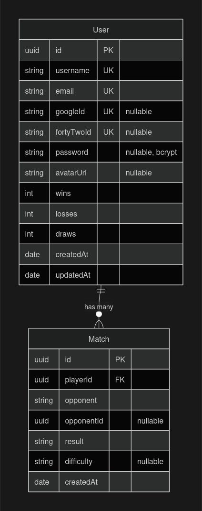

*This project has been created as part of the 42 curriculum by hguerrei, randrade, bbento-a, aaleixo-.*

# —   Description   ———————————————

**WawaConnect** is a full-stack web application game based on 4-connect. The project was developed with the goal of creating something fun and engaging that would entertain those who interacted with it, and be presented as the ft_transcendence project of the team’s 42 curriculum.

The application includes:

- Secure authentication (Email/Password + 42 OAuth + Google OAuth).
- User profiles and the ability to change information and profile picture.
- Multiplayer and AI opponents with varying difficulty.
- Spectator mode — anyone can follow an ongoing match live, receiving the same
real-time updates as the players without being able to interfere with the board.
- Match history and statistics with visual graphs.
- Responsive and modern UI.
- Multi-language support (Portuguese, English and German).
- HTTPS communication with a modified port to 2222 due to the default 443 https port being already in use.
- Docker deployment through individual containers for each: nginx, database, frontend and backend.
- Export of match history and statistics as CSV or PDF.
- Accessible Privacy Policy and Terms of Service pages, linked from the footer.

## —   Team Information   ——————————————————

| Member | Roles | Responsibilities |
| --- | --- | --- |
| hguerrei | PO, PM, Full-stack Developer | Defined the product vision and the feature backlog, prioritized what got built and when, ran the daily check-ins and tracked progress on Notion. On the code side, owned the game backend (real-time engine, AI opponent, match persistence) and the authentication layer (registration, login, logout, protected routes, account settings). |
| randrade | Tech Lead, Full-stack Developer | Owned the infrastructure and deployment: the Docker Compose topology, the container images, NGINX, Makefile. Wrote the architecture documentation. Implement webSockets + other small features |
| bbento-a | Front-end Developer | UI / UX Design; Visual elements implementation; Handle application’s pages responsiveness |
| aaleixo- | Full-stack Developer | OAuth login with both 42 and Google, user profile handling and Profile Picture file management. Helped with Frontend animations and simple css, also made the Privacy Policy and Terms of Service. |

## —   Project Management   ————————————————

For team coordination and alignment, here are most system/aspects that we decided to follow, and tools used that helped us during our time developing the project:

#### Organization

- Scheduled days in-site / remote working, with daily meetings to check team’s progress;
- Feature-based task distribution;
- Notion — for written group and project organization
- Figma — for web-pages and components design

#### Communication

- Discord — for remote communication
- Meetings in person.

#### GitHub Usage

- Using multiple individual branches for each member for production;
- Use of a dev branch with a stable version merges;
- Commit messages with small description of what was added.

## —   Technical Stack   ———————————————————

For our application stack, we aimed to choose technologies: 

- to which some of us were already familiar with (NextJS, NestJS and Docker);
- that are accessible and could facilitate project development + are commonly used in other stacks (PostgreSQL, Prima);
- that were required to use for certain modules (Google and 42 OAuth).

Here’s a list of all the technologies used for development:

#### Front-end

- NextJS — framework used for the web application’s frontend development based in React and Typescript;
- CSS Modules — as a styling solution for the application;
- next-intl — toolkit for internationalization, used for web-pages translations.

#### Back-end

- **NestJS 11 + TypeScript** — chosen for its module/provider/dependency-injection
structure (game gateway, auth, stats and database access are separate injectable
modules rather than one server file) and because the same process serves the REST
API and the WebSocket layer, with no second server.
- **Prisma 7 + `pg` + `@prisma/adapter-pg`** — typed database access. The `pg` driver
adapter is used instead of Prisma's default engine so connections go through a real
connection pool.
- **`class-validator` / `class-transformer`** — DTO validation through a global
`ValidationPipe({ whitelist: true })`, so any field not declared on a DTO is stripped
before it reaches a service. The server never trusts the shape of client input.
- **`@nestjs/config`** — environment configuration (`JWT_SECRET`, `DATABASE_URL`).
- **Passport + `passport-jwt` + `@nestjs/passport`** — authentication strategy with a
custom extractor that reads the JWT from the `httpOnly` cookie instead of the
`Authorization` header, plus `AuthGuard('jwt')` and a custom `OptionalJwtAuthGuard`
for pages that work both signed in and signed out.
- **`@nestjs/jwt`** — token signing, 24 h expiry.
- **`bcrypt`** — password hashing, 10 salt rounds; the salt is embedded in each hash.
- **`cookie-parser`** — reads the auth cookie on the HTTP pipeline. The WebSocket
handshake does not go through that pipeline, so the raw `cookie` package parses it
there instead — the same identity check applied in a second place, deliberately.
- **`@nestjs/throttler`** — global rate limit of 100 requests/min, tightened with
`@Throttle` on login and registration to blunt credential brute-forcing.
- **`@nestjs/websockets` + `@nestjs/platform-socket.io` + [socket.io](http://socket.io/) 4** — the real-time
layer: `OnGatewayConnection`/`OnGatewayDisconnect`, one room per match, a personal
channel per `user.id`, and reconnection grace periods before a disconnect becomes a
forfeit.
- **`multer`** (`diskStorage`) with `FileInterceptor` — avatar upload. The stored file
extension is derived from the detected mimetype rather than the client-supplied
`originalname`, so a filename cannot dictate what lands on disk. Files are served
through `useStaticAssets`.

> The AI opponent has **no external dependencies** — the minimax search is implemented
from scratch in `game/game.ai.ts`.
> 

#### Database

- **PostgreSQL** — chosen for relational integrity: every match row is tied to a real
user through a foreign key, and the statistics are only trustworthy if that link is
enforced by the database rather than by application code. It is also the database
Prisma supports most completely, and the one the team was most likely to encounter
again outside 42.
- **Prisma ORM** — typed schema and migrations; see the Database Schema section for
the model design.

#### Infrastructure and other

- NGINX — reverse proxy and the stack's single entry point: it terminates HTTPS and routes each request to the frontend or the backend, so the whole application is served from one origin;
- Docker — one container per service (nginx, frontend, backend, database), each built from a multi-stage image so the project runs the same way on any machine;
- Docker Compose — orchestrates the four containers, defining the networks that keep the database isolated, the volumes that persist data, the secrets that carry the credentials, and the startup order between services;
- Google OAuth;
- 42 OAuth;

## —   Database Schema   ——————————————————

### Overview

PostgreSQL, accessed exclusively through Prisma. Two tables: `User` and `Match`.



### `User`

One row per registered account, whatever the sign-up method.

| Field | Type | Constraints | Purpose |
| --- | --- | --- | --- |
| `id` | `String` (UUID) | primary key | Stable identifier. UUIDs instead of auto-increment so account IDs are not guessable or enumerable from a URL |
| `username` | `String` | unique | Display name, shown to opponents |
| `email` | `String` | unique | Login identity |
| `googleId` | `String?` | unique, nullable | Set only for Google sign-ups |
| `fortyTwoId` | `String?` | unique, nullable | Set only for 42 sign-ups |
| `password` | `String?` | nullable | bcrypt hash. Null for OAuth-only accounts, which never have a password to store |
| `avatarUrl` | `String?` | nullable | Profile picture; falls back to a default when null |
| `wins` / `losses` / `draws` | `Int` | default `0` | Running totals |
| `createdAt` | `DateTime` | default `now()` | Account creation |
| `updatedAt` | `DateTime` | `@updatedAt` | Last change to the account |
| `matches` | `Match[]` | relation | All match records belonging to this player |

**Why the three ID fields are nullable and separate.** A user signs up through
email/password, Google, or 42, and only the matching field is filled. Keeping them
as three distinct nullable columns (rather than one `provider` + `providerId` pair)
means a single account can later be linked to more than one provider without
migrating rows.

**Why `password` is nullable.** An account created through OAuth has no password at
all. Storing an empty string or a placeholder hash would make "does this account have
a password?" an ambiguous question in the login and change-password flows; `null`
answers it directly.

### `Match`

**One row per player, per game — not one row per game.** This is the part worth
reading twice:

| Game played | Rows created |
| --- | --- |
| Alice beats Bob | 2 rows: Alice `result: "win"`, Bob `result: "loss"` |
| Alice draws with Bob | 2 rows: both `result: "draw"` |
| Alice beats the AI on hard | 1 row: Alice `result: "win"`, `difficulty: "hard"` |

| Field | Type | Constraints | Purpose |
| --- | --- | --- | --- |
| `id` | `String` (UUID) | primary key | Record identifier |
| `playerId` | `String` (UUID) | FK → `User.id`, `onDelete: Cascade` | Whose history this row belongs to |
| `opponent` | `String` | required | Opponent's username **at the time of the game**, or `"AI"` |
| `opponentId` | `String?` (UUID) | nullable | Opponent's stable `User.id`. Null when the opponent was the AI |
| `result` | `String` | required | `"win"` | `"loss"` | `"draw"`, always from `playerId`'s perspective |
| `difficulty` | `String?` | nullable | `"easy"` | `"medium"` | `"hard"`. Null for human opponents |
| `createdAt` | `DateTime` | default `now()` | When the game ended; drives date filters and the timeline graphs |

**Index:** `@@index([playerId, createdAt])` — the dashboard's dominant query is
"this player's matches, newest first", and this covers it directly.

**Why one row per perspective.** `result` is stored relative to the row's owner, so
rendering a player's history is a single filtered read with no per-row logic to work
out which side they were on. The alternative — one row per game with `playerA`,
`playerB` and a winner — makes every history query a two-branch `OR` and every result
a conditional.

**Why both `opponent` and `opponentId`.** `opponent` is a snapshot of the username as
it was when the game was played, so old history stays truthful if the opponent
renames themselves. `opponentId` is the stable link used to make their name clickable
through to their current profile. Neither alone does both jobs.

**Why `onDelete: Cascade`.** A deleted account takes its match history with it,
instead of leaving rows pointing at a user that no longer exists.

**Why the counters are duplicated.** `wins`/`losses`/`draws` on `User` are
denormalized totals that could be recomputed by counting `Match` rows. They are kept
because the profile header needs them on every page load and a counter read beats an
aggregate query; the `Match` table is what powers the graphs, date filters and
opponent breakdowns. The trade-off is that both are written in the same transaction
when a game ends — if that ever failed halfway, the counters and the history would
disagree.

### Known limitations of the schema

- There is no shared `gameId` joining the two rows of a human-vs-human game, so the
two perspectives of the same match cannot be paired back together at the database
level.
- No move-by-move history is stored — only final results, so a finished game cannot
be replayed.

## —   Features List  ————————————————————

| Feature | Description | Developed By |
| --- | --- | --- |
| Authentication | Email/password registration and login, logout, and session handling through JWTs stored in `httpOnly` cookies | hguerrei |
| OAuth Login | Google & 42 login Authentication | aaleixo- |
| Account Settings | Check and update account’s information (like username, email, password,avatar) | hguerrei, bbento-a, aaleixo- |
| Multiplayer Game |  Real-time 4-connect matches over WebSockets: move validation, turn control, win/draw detection, and reconnection with grace periods before a disconnect becomes a forfeit  | hguerrei, randrade |
| AI Opponent | Minimax opponent with alpha-beta pruning, exposed at three difficulty levels | hguerrei |
| Match History | Every finished match is persisted with both players, result, difficulty (for AI matches) and timestamp | hguerrei |
| Dashboard | Player statistics built from match history — games played, wins, draws, losses, opponents faced — rendered as visual graphs | hguerrei |
| Internationalization | Multiple languages support | aaleixo-, bbento-a, hguerrei |
| HTTPS | Secure communications | randrade |
| Protected Routes | Guard-based access control: unauthenticated requests are rejected at the route level on the API and at the socket handshake for real-time events | hguerrei |
| Data Export | Statistics can be exported as CSV or PDF  | hguerrei |
| Rate Limiting |  Global request throttling, with tighter limits on login and registration to blunt brute-force attempts  | hguerrei |
| Privacy Policy & Terms of Service  |  Dedicated pages covering what data the application stores and how accounts are handled, reachable from the footer on every page | aaleixo- |

## —   Modules  ——————————————————————

#### Major — 6 Modules (12pts)

- **Framework front + back** — *hguerrei, randrade, bbento-a, aaleixo-*.
NextJS (React + TypeScript) on the frontend and NestJS on the backend. Both were
picked because part of the team had already worked with them, so the learning curve
did not compete with the module workload. NestJS also matched the shape of the
backend directly: its module/provider/dependency-injection structure keeps the game
gateway, the auth layer and Prisma access as separate injectable modules instead of
one server file, and it ships first-class [Socket.IO](http://socket.io/) gateway support — the same
framework serves the REST API and the WebSocket layer, with no second server.
On the frontend, NextJS provided routing and a clean integration point for
`next-intl`, which carries the multi-language module.
- **Real-time features using WebSockets** — *hguerrei, randrade*.
Implemented with a NestJS [Socket.IO](http://socket.io/) gateway. Players are identified by a stable
`userId` read from the JWT cookie during the handshake rather than by `socket.id`.
The server holds the authoritative board and broadcasts each state change to
everyone in the match room at once — both players and any spectators — so no client
ever derives state locally. Disconnections are handled as a state rather than an
ending: the room is told a player dropped and the match is held open, so the
connection lifecycle never corrupts a game in progress.
- **AI Opponent** — *hguerrei*.
Minimax with alpha-beta pruning. Difficulty is controlled by search depth, so the
same algorithm serves all three levels instead of three separate bots.
- **Complete web-based game** — *hguerrei*.
Full match lifecycle server-side: board state, legal-move validation, turn
enforcement, win/draw detection and result persistence.
- **Remote players** — *hguerrei, randrade*.
Two players on separate machines play the same match in real time. The clients send
only intents (a column number), never board state, so nothing depends on the two
machines agreeing. Reconnection logic closes the gap that separate machines
introduce: a dropped or refreshed client rejoins its room and is sent the current
board, and only after a grace period expires (`HOST_RECONNECT_GRACE_MS`,
`FORFEIT_GRACE_PERIOD_MS`) does the disconnect become a forfeit — so a brief network
drop does not hand the match to the opponent.
- **Advanced analytics dashboard** — *hguerrei*.
Aggregation queries over the `Match` table feed the statistics graphs.

#### Minor — 6 Modules (6pts)

- Custom-made design system with reusable components — *bbento-a*
Features a consistent UI system made exclusively for the project, with component elements found in the /components frontend’s app folder, and with icons, logos and assets available in the /public also in the frontend’s app folder.
- Support for multiple languages (at least 3 languages) — *aaleixo-, bbento-a*
- Support for additional browsers — *bbento-a*
- Remote authentication with OAuth 2.0 — *aaleixo-*
- **Spectator mode** — *hguerrei*.
Spectators join the match room and receive state updates, but are tracked
separately in the gateway so their move events are rejected.
- **ORM** — *hguerrei, randrade*.
Prisma over PostgreSQL for the `User` and `Match` models.

#### Total: **18 Points**

## —   Individual Contributions  ———————————————

### aaleixo-

- Authentication and user account management
    - Implemented OAuth authentication through both **42** and **Google** login providers.
    - Integrated the authentication flow with the application’s existing user management system.
    - Handled different authentication states, including login, logout, session persistence, and authentication errors.
    - Ensured that authenticated users are correctly redirected through the application according to their account state.
- Profile picture handling
    - Implemented functionality for users to add and manage their profile pictures.
    - Integrated profile picture display throughout the application where user information is presented.
    - Handled different profile picture states, including users without an uploaded image.
    - Ensured profile images are correctly loaded and displayed across different UI components and screen sizes.
- Multiple language support
    - Implemented the application's multilingual functionality to support different languages.
    - Integrated translated text into the relevant application components and pages.
    - Structured language-dependent content to make future translations and additional languages easier to implement.
    - Helped ensure that translated elements remained correctly integrated with the existing UI and user flow.
- Privacy Policy and Terms and Conditions
    - Implemented dedicated pages for the project's **Privacy Policy** and **Terms and Conditions**.
    - Integrated access to these pages within the application's navigation and relevant user flows.
    - Structured the pages so that legal information is clearly accessible and separated from the application's main content.
- Error handling and application reliability
    - Implemented and handled minor errors occurring throughout the application's authentication and user interaction flows.
    - Added safeguards for unexpected states and invalid user interactions.
    - Fixed minor issues discovered during development and testing.
    - Assisted with debugging and resolving integration problems between different application features.
- Front-end and UI integration
    - Integrated functional features into the existing front-end structure developed with **NextJS.**
    - Connected authentication, user data, profile information, and other application features with the existing UI components.
    - Ensured newly implemented functionality remained consistent with the project's visual identity and UX flow.
    - Worked alongside the visual development to ensure functional and interactive elements behaved correctly within the designed interfaces.
- Feature integration and application testing
    - Tested implemented features across different application states and user flows.
    - Identified inconsistencies and minor bugs during development and corrected them.
    - Verified that newly integrated functionality worked correctly alongside the project's existing features.
    - Assisted in maintaining consistency between the application's front-end behavior and its intended user experience.

#### Challenges

- Overall learning of **NestJS** and **OAuth authentication**;
- Understanding and integrating multiple authentication providers, especially when handling different OAuth flows, user sessions, authentication states, and potential login errors;
- Implementing profile picture handling while ensuring images were correctly stored, retrieved, displayed, and integrated with the existing user interface with deletion of previous files;
- Integrating newly developed functional features into the existing front-end without compromising the visual identity, UX flow, or organization of the application;
- Handling unexpected user interactions and minor application errors while maintaining a smooth and understandable experience for the user;

### bbento-a

- Preliminary conceptualization and development of the project's aesthetic and UX flow;
    - Brainstorm necessary pages with their corresponding future elements and features;
    - Projected user’s flow through every page on the application;
    - Gathered reference for project’s visual identity.
- Design of visual elements on the UI from scratch;
    - Sketched pages and elements through wireframes;
    - Created an exclusive colour palette for project’s identity consistence;
    - Design different elements version for UI / UX testing experience;
    - All project’s design available on a Figma board for designer’s accessibility.
- Integration of most visual elements for project’s front-end
    - Implemented components for better code organization and readability;
    - Applied layout page feature on NextJS, that keeps repeated elements from every page in one single file;
    - Usage of NextJS components for elements and app optimization;
    - Usage of React states for better user interaction and experience.
- Handle web-pages responsiveness
    - Readjusted UI on certain screen breakpoints, having as reference generic and specific devices’ screens from Google Chrome Devtools and personal mobile devices.
- Support in language translations
    - Helped in some elements’ translation.

#### Challenges

- Overall learning used technologies from scratch;
- Frontend’s SSR implementation for application optimization and better SEO on certain application pages;
- Consistent web-page responsiveness with specific elements (different translations, usernames, error messages, etc…);
- User experience when in a match — The improvement of their experience when playing the game

### hguerrei

- Product and project management
    - Owned the product vision and the backlog: decided which modules the team would
    target and in what order, and kept scope aligned with the point requirement.
    - Ran the daily progress check-ins and the feature-based task distribution;
    maintained the project organization on Notion.
- Game backend (NestJS + Socket.IO)
    - Built the real-time game engine: board representation, legal-move validation,
    turn enforcement, win and draw detection, and match lifecycle.
    - Designed the gateway around a stable `userId` extracted from the JWT cookie at
    handshake time instead of the volatile `socket.id`. This single decision is what
    allows a player to drop and rejoin an ongoing match, and what lets results be
    attributed to real accounts for the statistics.
    - Kept the server authoritative: the client sends a column, never a board state,
    so a tampered client cannot forge a move or a win.
    - Added spectator tracking so viewers receive live updates without being able to act
    on the board.
    - Refactored all the duplicated end-of-match paths (win, draw, forfeit,
    disconnection) into a single reusable `endGame` method that both broadcasts the
    result and writes the match record.
- Authentication, account and route protection
    - Email/password registration, login and logout. Passwords are never stored in
    plaintext: they are hashed with `bcrypt` (10 salt rounds), which generates and
    embeds a unique per-password salt in the resulting hash, so no separate salt
    column is needed and two users with the same password do not share a hash.
    - Changing a password requires the current one: it is re-verified with
    `bcrypt.compare` before the new value is hashed and stored, so a hijacked session
    alone is not enough to take over an account.
    - JWTs issued as `httpOnly` cookies rather than kept in browser storage, so the
    token is not reachable from JavaScript; validated by a `JwtStrategy` built on
    `passport-jwt`.
    - Protected the API routes with guards, and applied the same identity check to the
    WebSocket handshake so real-time events cannot bypass HTTP auth.
    - Account settings: profile updates and credential changes.
- AI opponent — no external dependencies, implemented from scratch in `game/game.ai.ts`
    - Minimax search with alpha-beta pruning and a board-evaluation heuristic; the
    three difficulty levels are different search depths over the same algorithm.
    - Moves are explored from the centre columns outwards. Ordering matters here:
    alpha-beta only prunes well when strong moves are examined first, and in
    Connect Four the centre is where the strong moves are.
    - Column heights are kept in an `Int8Array` so the search updates and undoes moves
    cheaply instead of copying a board at every node.
    - Search runs against a time budget rather than depth alone, so the hardest level
    cannot stall a match on an awkward position.
    - Integrated as `PlayAIMove` inside `GameService` and exposed through a `playVsAI`
    socket event, reusing the exact same game loop as human matches.
- Dashboard and data export
    - Built the statistics dashboard: games played, wins, draws and losses, results
    over time, and a breakdown by opponent, backed by aggregation queries over the
    `Match` table.
    - Because match rows are stored one per player perspective, every dashboard query
    is a single filtered read on `playerId` with no per-row logic to work out which
    side the player was on — the schema decision and the dashboard were designed
    together.
    - Added CSV and PDF export, generated client-side from the data
    already loaded into the dashboard.
- Persistence and statistics
    - `Match` model in Prisma, written on every completed game with both players, the
    result, the difficulty for AI matches, and the timestamp.
    - Aggregated wins, draws, losses and opponent breakdowns to feed the dashboard.

#### Challenges

- **Auth on the WebSocket handshake.** Middleware ordering in `main.ts` meant cookies
were not parsed by the time the socket authentication ran, so every connection
looked anonymous. Fixed by ordering the middleware correctly — and the same area
hid a silent `cookie.parsed` vs `cookie.parse` typo that failed without an error.
- **Identifying players reliably.** The first implementation keyed games on
`socket.id`, which changes on every reconnect: a refresh lost the match. Moving to
the JWT `userId` fixed reconnection and was also the prerequisite for persistent
stats.
- **Spectators could play.** Spectators were being handled as participants and could
submit moves. Fixed by tracking them in a dedicated `Set<string>` in the gateway
and rejecting move events from anyone in it.
- **`"Player null wins!"` on a draw.** The end-of-match broadcast assumed a winner
always existed. Caught while testing full games with the terminal client, and
removed as part of the `endGame` refactor.
- **NestJS/TypeScript wiring.** A missing Prisma constructor injection and
`import type` fixes required by `isolatedModules` — small, but they blocked builds
until the dependency-injection and compilation model was properly understood.

### randrade

- Makefile as the single entry point
    - `make` on a fresh clone writes the config, generates the secrets, builds the images and starts everything.
    - Separate production and development stacks, plus inspection and cleaning targets.
- Docker Compose topology
    - four single-purpose containers split across two networks, with only one published port in the whole stack.
    - protected variables with secrets.
    - Multi-stage Dockerfiles for the backend and frontend. Build tooling never reaches the final image, and both containers run as non-root users.
- NGINX as the single entry point
    - TLS termination with a self-signed certificate, path-based routing to the backend and frontend, and the WebSocket upgrade for the game.
- Frontend real-time layer (`useGameSocket`)
    - the single hook every game page uses to talk to the gateway. It opens the Socket.IO connection to the page's own origin, so the auth cookie travels in the handshake and the server can identify the player, registers every event handler once, and turns each incoming event into React state. The board on screen is always a render of the last state the server sent, never something the client works out for itself; outgoing actions carry only an intent — a column number — never a board.
    - Client-side connection lifecycle — the socket is opened and closed with the component, and both the socket and the current room id live in refs, so handlers registered once never read stale values. A deliberate exit holds the socket open until the server acknowledges it, so the "leave room" message cannot die with the connection and leave the player stuck inside the room.

#### Challenges

- General learning of full-stack dynamic and concepts.
- Deciding the best architecture for the whole project.

# —   Instructions   ———————————————

#### Requirements:

- Docker (with Docker Compose v2)
- Make

---

#### Running Instructions:

Inside the project folder, one command builds and starts everything:

```bash
make
```

On a first run this also creates the two files the stack needs, so there is nothing to write by hand beforehand:

- **`.env`** — non-secret configuration, copied from the committed `.env.example`. Holds the database user/name, the OAuth **client ids** and the callback URLs.
- **`secrets/`** — one credential per file, gitignored. The database password and the JWT signing key are generated with `openssl rand -hex 32`; the two OAuth client secrets start as the placeholder `CHANGE_ME`.

Then open **[https://localhost:2222/**](https://localhost:2222/**). The certificate is self-signed, so the browser will warn once — *Advanced → Proceed to localhost*.

---

#### Enabling OAuth login (optional)

The stack runs without this; only "Sign in with Google" and "Sign in with 42" stay unavailable. To enable them, register an application at [Google Cloud Console](https://console.cloud.google.com/) and at [42 intra](https://profile.intra.42.fr/oauth/applications), then:

1. Put the **client ids** and callback URLs in `.env`:
    
    ```markdown
    GOOGLE_CLIENT_ID=<google client id>
    GOOGLE_CALLBACK_URL=https://localhost:2222/api/auth/google/redir
    
    # the FT_ prefix is used because a shell variable name cannot start with a
    # digit; the backend receives them as 42_CLIENT_ID / 42_CALLBACK_URL
    FT_CLIENT_ID=<42 client id>
    FT_CALLBACK_URL=https://localhost:2222/api/auth/42/redir
    ```
    
2. Put the **client secrets** in their own files, one bare value per file, no `KEY=` prefix and no quotes:
    
    ```
    secrets/google_client_secret.txt
    secrets/ft_client_secret.txt
    ```
    
3. Restart so the containers pick up the new values:
    
    ```bash
    make re
    ```
    

> If you already have a `.env` from an earlier version, `make` will **not** overwrite it — it only warns about keys that are missing entirely. Compare it against `.env.example` by hand, or delete it and run `make` again.
> 

---

#### Other useful commands

```bash
make dev        # development stack with hot reload
make ps         # container state and health
make logs       # follow all services
make psql       # interactive database shell
make clean      # stop everything, keep the database
make fclean     # remove everything, including volumes and images
```

# —   Resources   ———————————————

### aaleixo-

- [https://www.passportjs.org/packages/passport-google-oauth20/](https://www.passportjs.org/packages/passport-google-oauth20/) - OAuth
- [https://docs.nestjs.com/v5/](https://docs.nestjs.com/v5/) - NestJS basics
- [https://www.passportjs.org/packages/passport-42/](https://www.passportjs.org/packages/passport-42/) - passport.js 42 api
- [https://www.passportjs.org/packages/passport-google-oauth2/](https://www.passportjs.org/packages/passport-google-oauth2/) - passport.js google oauth 2.0
- [https://api.intra.42.fr/apidoc/guides/](https://api.intra.42.fr/apidoc/guides/) - 42 api docs

### bbento-a

- [https://nextjs.org/docs](https://nextjs.org/docs) — NextJS official documentation
- [https://react.dev/reference/react](https://react.dev/reference/react) — React documentation for developers
- [https://www.w3schools.com/cssref/index.php](https://www.w3schools.com/cssref/index.php) — Lookup for CSS styling rules descriptions
- [https://youtube.com/playlist?list=PL4cUxeGkcC9jZIVqmy_QhfQdi6mzQvJnT&si=FZCgXYyKdY1PRq8A](https://www.youtube.com/playlist?list=PL4cUxeGkcC9jZIVqmy_QhfQdi6mzQvJnT) — NextJS Guide for building an application
- [https://www.youtube.com/playlist?list=PL4cUxeGkcC9gZD-Tvwfod2gaISzfRiP9d](https://www.youtube.com/playlist?list=PL4cUxeGkcC9gZD-Tvwfod2gaISzfRiP9d) — React Guide for building components, state usage, etc…

### hguerrei

- [https://docs.nestjs.com/](https://docs.nestjs.com/) — NestJS modules, providers, guards and dependency injection
- [https://docs.nestjs.com/websockets/gateways](https://docs.nestjs.com/websockets/gateways) — Socket.IO gateways in NestJS
- [https://socket.io/docs/v4/](https://socket.io/docs/v4/) — rooms, handshake and reconnection semantics
- [https://www.prisma.io/docs](https://www.prisma.io/docs) — Prisma schema, migrations and queries
- [https://www.passportjs.org/packages/passport-jwt/](https://www.passportjs.org/packages/passport-jwt/) — JWT strategy
- [https://docs.nestjs.com/security/authentication](https://docs.nestjs.com/security/authentication) — cookie-based JWT authentication
- [https://en.wikipedia.org/wiki/Minimax](https://en.wikipedia.org/wiki/Minimax) and [https://en.wikipedia.org/wiki/Alpha%E2%80%93beta_pruning](https://en.wikipedia.org/wiki/Alpha%E2%80%93beta_pruning) — AI opponent algorithm

### randrade

- [https://docs.docker.com/reference/compose-file/](https://docs.docker.com/reference/compose-file/) — the Compose specification: services, networks, volumes, secrets
- [https://docs.docker.com/engine/swarm/secrets/](https://docs.docker.com/engine/swarm/secrets/) — how Docker secrets are mounted, and what differs outside swarm
- [https://docs.docker.com/build/building/multi-stage/](https://docs.docker.com/build/building/multi-stage/) — multi-stage builds
- [https://nginx.org/en/docs/http/websocket.html](https://nginx.org/en/docs/http/websocket.html) — the WebSocket upgrade pattern
- [https://docs.nestjs.com/](https://docs.nestjs.com/) — NestJS modules, providers, guards and dependency injection
- [https://docs.nestjs.com/websockets/gateways](https://docs.nestjs.com/websockets/gateways) — Socket.IO gateways in NestJS

## —   AI usage   ——————————————————————

- Helping with documentation drafts for the files in docs/architure/.
- Generating tests for the project.
- Consolidation of learned knowledge.

**Tools Used**: Claude

Disclouser: AI was used consciously and critically, acting as a supplementary learning tool to accelerate understanding, not to skip learning steps. All architectural decisions, code implementations, and debugging sessions were manually driven.